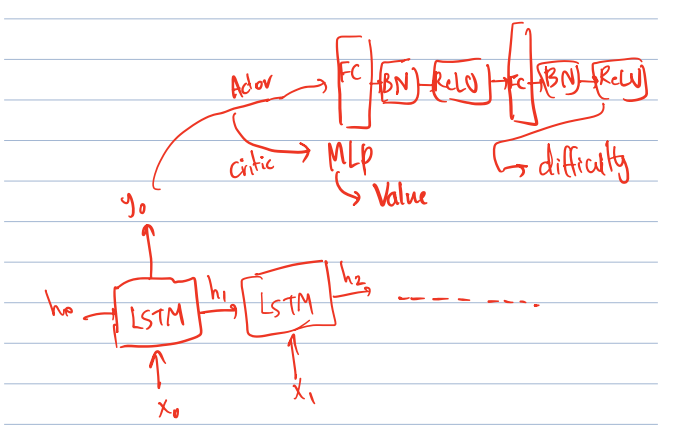
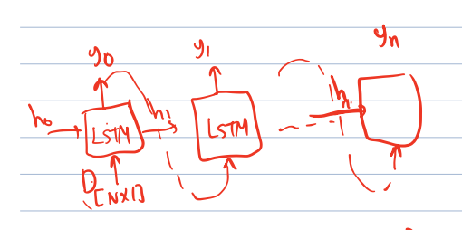

# Teacher Model and Reward Discussion

### The Problem 
- The teacher training converages quickly (with low reward), while the robot average reward goes up. 

- Teacher model should NOT depend on the difficulty of the last robot session.

- Teacher should be able to generate maps with specific difficulties accurately. 

### Reward

- Teacher reward should be increased with a certain value if the robot reached the goal, independently of how fast did it reach the goal.

### Teacher Model

#### Definition
Since we want the teacher to abide by a certain difficulty in its enironmemnt generation, the teacher model should be split up into parts:

(1) Feature Extractor + Actor/Critic Model
(2) Generator Model

The (1) model should take in the following:

- Number of sucesses for the last robot session
- Robot average reward for the last robot session
- Average number of steps per episode for the last robot session
- Robot level of the upcoming session

and produce the difficulty of the upcoming session. 

The (2) model should take in a difficulty value and produce an enivornment abiding by the provided difficulty. 

#### Implemenation
Since the nature of (1) model is sequential, LSTM can be used to generate the upcoming difficulties, with each step taking the last teacher state. 

As the outputs of (2) should be sequential (x_i depends on x_j where j < i, LSTM decoder model could be used as an implementation.

#### Training

The (1) model can be trained using the existing reward function in the wrapper environemnt with the addition of the pre-mentioned part. 

Since (2) model is independent from (1), their training can be decoupled. The (2) should be pre-trained using:

- Supervised learning: 
    - Data could be collected using random environment generator with the teacher checker computing the difficulty of each generated enironment. 

    - MSE could be used to train the model on such data. 
    - Advantage: faster training, stable learning.
    - Disadvantages: Dataset collection migth biased, limits the ways of generating a specific difficulty. 

- Reinforcement learning: 
    - Reward could be r = - (desired_difficulty - generated_difficulty) ^ 2.

    - LSTM model can be trained as a decoder, with stopping criteria for a `max_num_obstacles` for each generation (this is like <eos> token in language models). 

    - Advatages: Can be really creative and not limited.
    - Disadvantages: Longer time, less stable training.

Trained models (2) - from reinforcement or supervised schemes - can be saved and used later in integration with the (1) model to take in the predicted difficulty for the next training session, and generate the upcoming environment accurately. 